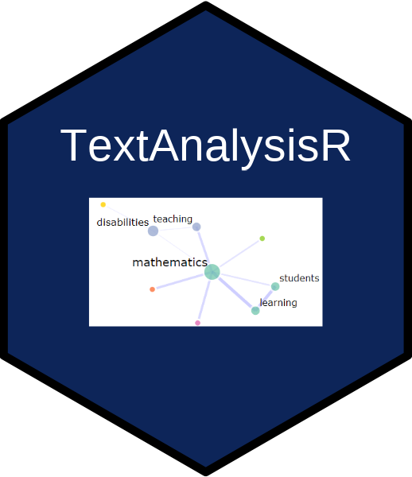

Comprehensive toolkit for text mining and natural language processing
with an interactive `Shiny` interface. Import documents from multiple
formats (`PDF`, `DOCX`, `XLSX`, `CSV`, `TXT`) using
[Marker](https://github.com/VikParuchuri/marker) for PDF extraction,
preprocess with [quanteda](https://github.com/quanteda/quanteda), and
perform linguistic analysis via [spaCy](https://spacy.io/), topic
modeling ([stm](https://github.com/bstewart/stm),
[BERTopic](https://maartengr.github.io/BERTopic/)), semantic analysis,
sentiment analysis, and network visualization with
[plotly](https://plotly.com/r/). Features topic-grounded content
generation via local ([Ollama](https://ollama.com)) and web-based
([OpenAI](https://platform.openai.com/),
[Gemini](https://ai.google.dev/)) APIs, `WCAG 2.1 AA` accessibility,
multi-language support, and enterprise security for production
deployment.

## Installation

The development version from
[GitHub](https://github.com/mshin77/TextAnalysisR) with:

    install.packages("devtools")
    devtools::install_github("mshin77/TextAnalysisR")

## Load the TextAnalysisR Package

    library(TextAnalysisR)

## Alternatively, Launch and Browse the Shiny App

Access the web app at <https://www.textanalysisr.org>.

Launch and browse the app on the local computer:

    run_app()

## Getting Started

See [Quick
Start](https://mshin77.github.io/TextAnalysisR/articles/quickstart.html)
for tutorials.

## Citation

- Shin, M. (2025). *TextAnalysisR: A text mining workflow tool* (R
  package version 0.0.3) \[Computer software\].
  <https://mshin77.github.io/TextAnalysisR>

- Shin, M. (2026). *TextAnalysisR: A text mining workflow tool* \[Web
  application\]. <https://www.textanalysisr.org>
